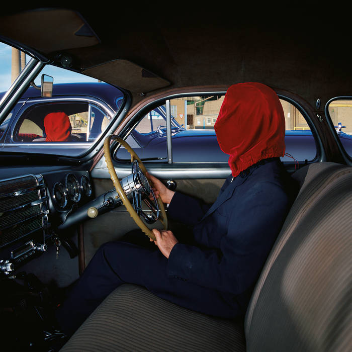
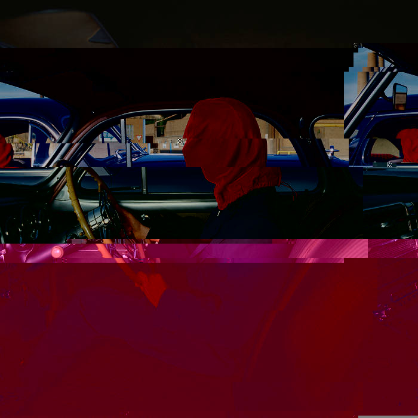

This program takes a JPG file and modifies data segments to create glitch art. The JPG file must be the first argument in the command line.
The odds of a byte being modified, and the minimum and maximum value the byte can be changed to can be adjusted with the command line.
Specific segments can be targeted to be modified. These arguments must be viable markers found in supplied JPEG file. The program will use the ranges of these markers to modify the file's data.
The list of markers found in the JPG file can be printed using the -p option.

EXAMPLE:

EXAMPLE 2:

